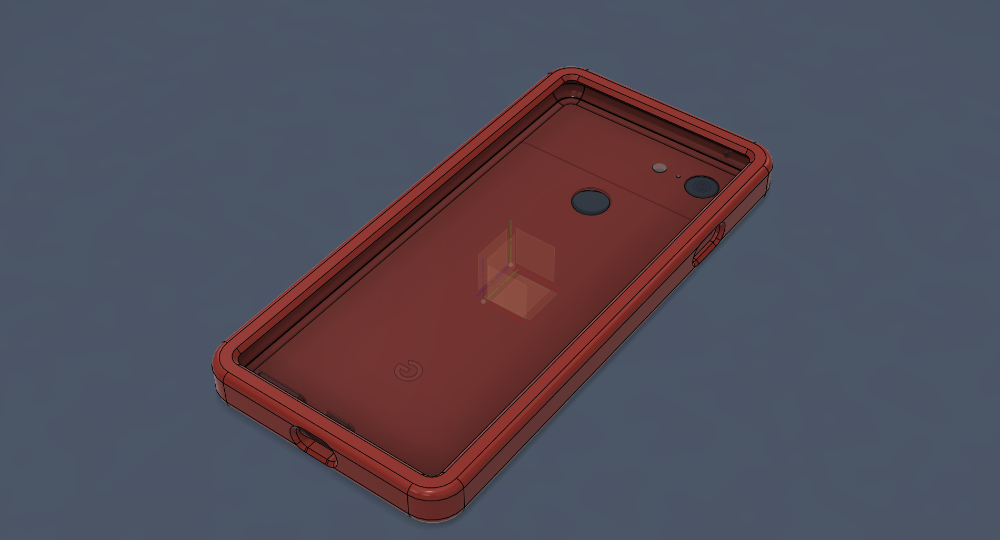

#📝 I learned...

** Importing step file**
  - used for reverse engineering
 
 
 

** Joint **
  - Positioning things to desired location, typically the imported 3d model to the origin if not alreayd there.

 
 
 

** 3D offset **
  - In the name, creates offset on 3d models instead of 2d sketches.

🛠️ **What I designed**

A phone case

  <figure>
    
    <figcaption style="display: block; text-align: center;">Final product of the phone case.</figcaption>
  </figure>

