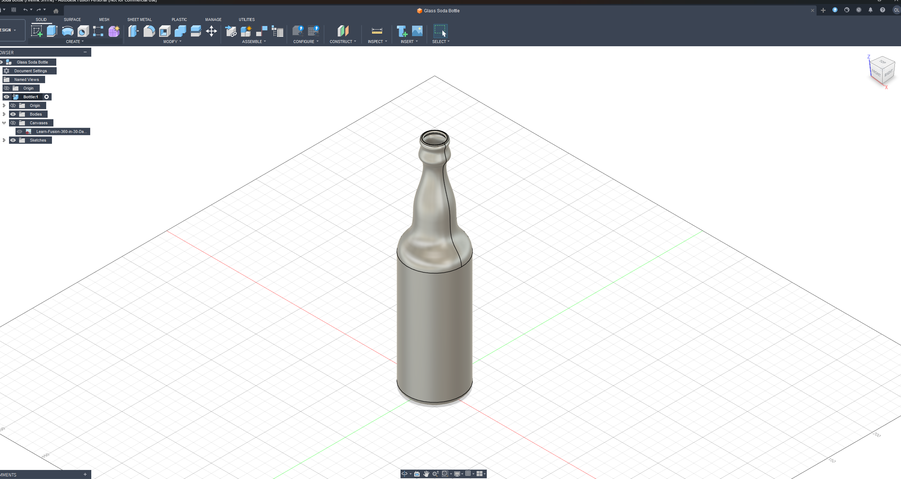

#📝 I learned...

**Insert Reference Image**

   -Enrich the ability to reverse engineer CAD designs.

   -Making easier to match real life dimensions.

 
 

**Create a Fit Point Spline**

  -Enables the ability to sketch line with curvatures.

 
 

**The Revolve Feature**

   -Converting a 2D sketch into 3D shape by integrating around the x y z axis.

 
 

**Horizontal/Vertical Constraints**

   -Allows smooth connection of lines.

 
 

**Inserting Appearance of Real Life Material**

   -Gains the ability to to see what the design looks like in real life.

 
 

🛠️ **What I Built**

A simple soda bottle, used to shell feature as well to make the inside hollow.

  <figure>
    
    <figcaption style="display: block; text-align: center;">FInal product of the soda bottle</figcaption>
  </figure>

