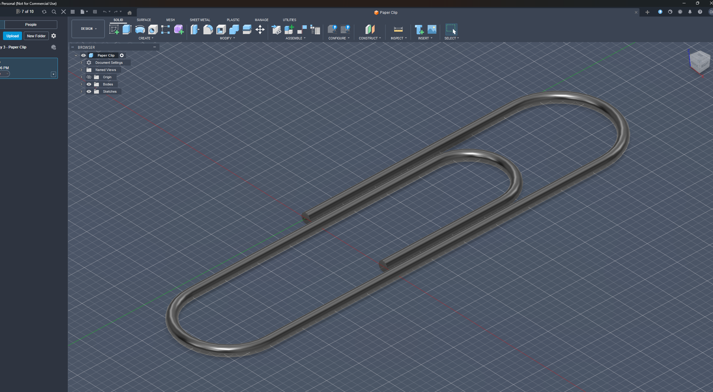

#📝 I learned...

**Tanget arcs**

   - Creates a smooth semicircle connection between two points

  

 
 

**Sweep Feature**

  -extrude along a path of sketches, can be used to create complext shapes.
  -Chain selection (sweep either a whole path or untick to choose specific sketches)
  -After sweeping, you can choose distance (1-0 means 1%-100%), its the arc length of the sweep. like the one you learned in Spesh.

🛠️ **What I designed**

A simple paperclip.

  <figure>
    
    <figcaption style="display: block; text-align: center;">Final product of the paper clip</figcaption>
  </figure>

