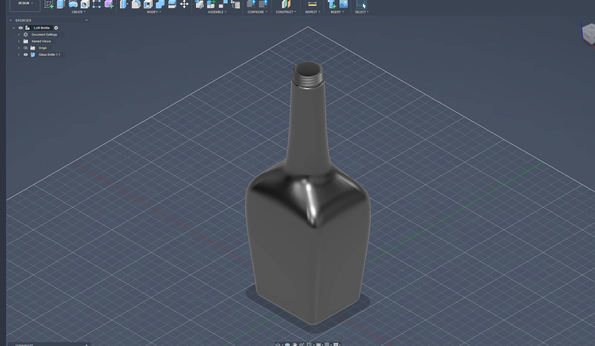

#📝 I learned...

**Loft**

   - Creates transitional shapen between two or more sketches. Can be used when shapes are not entirely symmetrical around the axis.
     

  

 
 

**Guide rails**

  - Can be used to assist loft. GRs can be creatued using lines, fit point spline etc.
 
 

**Intersection between sketch and plane**

   - Can be used to assist the making of guide rails.
   - allow easier sketch mirroring
  
  
 
**Mirror sketch**

   - It is in the name, it mirrors your sketches, just make sure you are picking the right axis. In this case it's the Z axis.
   

  

 
 

**Thread**

   - It's in the name, nothing much to say.
 
 

🛠️ **What I designed**

A simple paperclip.

  <figure>
    
    <figcaption style="display: block; text-align: center;">Final product of the loft bottle.</figcaption>
  </figure>

