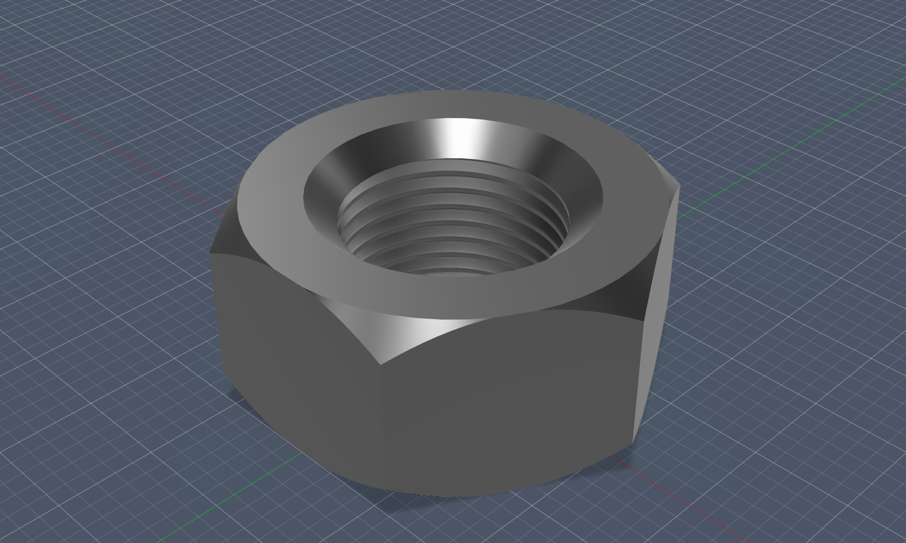

#📝 I learned...

**Sketch -> Create -> Project**

   - When already having a 3d object, using such tool can help assist further sketching
   - Helps define a starting point for further sketch

  

 
 

**Revolving using selected axis**

   - When using revolve feature, you can go on the left side and select the axis from the face list.
   - Doing so creates a chamferred pattern on the hexagonal shape.
 
 

**Hole**

   - Creates a literal hole in the preexisting shape.
   - Further settings can be appllied, making it threaded.
  
 
**Construction of midplane**

   - allows a sketch plane to be created in the middle of two existing faces. 

  
  
 

**3d mirror**
   - Select face and then choose axis (from left list)
   - Mirrors the shape.

  
  

🛠️ **What I designed**

A Ice Cube Tray

  <figure>
    
    <figcaption style="display: block; text-align: center;">Final product of the Hex Nut.</figcaption>
  </figure>

