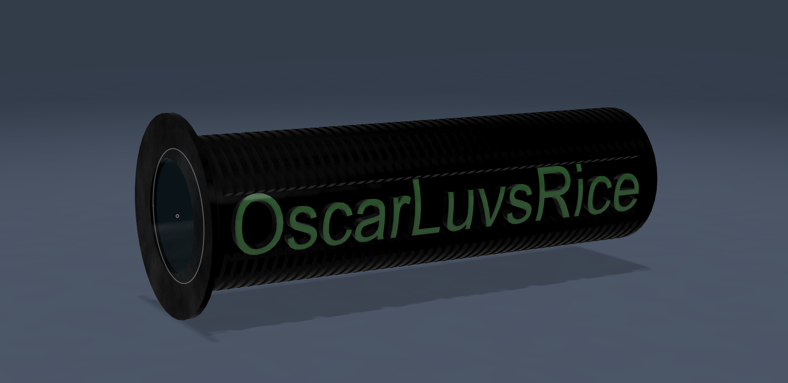

#📝 I learned...

**Emboss**

   - Prints or carves text onto existing geometry.
   - Online tutorial didn't work for me, i figured my own way to do it by using tangential plane.

  

 
 

**Project**

   - From my interpretation, Project allows the user to use 3d geometry as a reference point to use in 2d sketching.
   - For example: if you look at a cylinder from the side, you can use project to reference the circle and use it for offset pruposes or smt.
 
 

🛠️ **What I designed**

A Bike handlebar embossed with my ign

  <figure>
    
    <figcaption style="display: block; text-align: center;">Final product of the Bike Handlebar.</figcaption>
  </figure>

