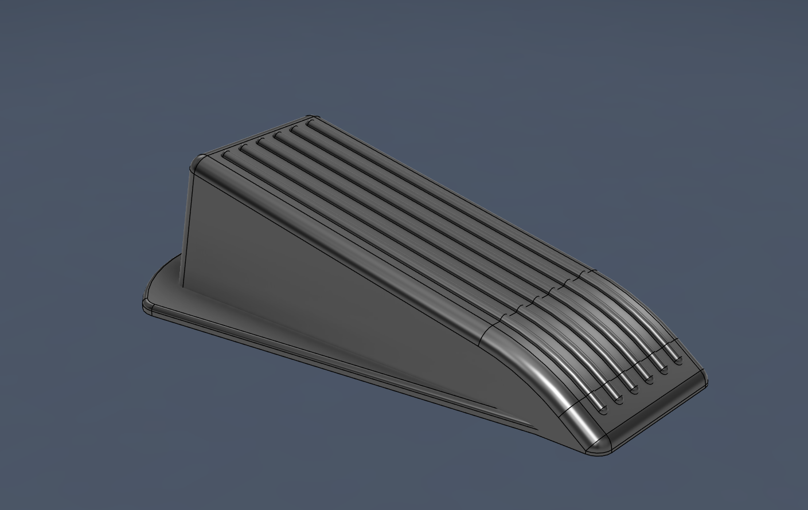

#📝 I learned...

**Advance Contraints**

   - using Contraints, you can have create restrictions on point and lines, point and points and lines and lines. You can make restrictions like length, radius, angle etc.
   - You can also make contraints function of each other, say that you already have a contraint d1, your second contraint after making it, for the dimension click the first dimension, the second contraint will become a function of d1.

  

 
 

**Chamfer Tool**

   - Essentially another style of fillet, you should normally always apply chamfer before fillet when using it.
   - For fillet and chamfer, you can press + and X on the side to add multiple of it.

 
 

**Emboss from existing sketch**

   - unlike the previous day where you emboss from text, you can make any geometric shape first and then emboss that shape onto your 3d object.
   - just make sure to ctrl if multiple face are used and untick tangent chain.

 
 

🛠️ **What I designed**

A doorstop

  <figure>
    
    <figcaption style="display: block; text-align: center;">Final product of the doorstop.</figcaption>
  </figure>

