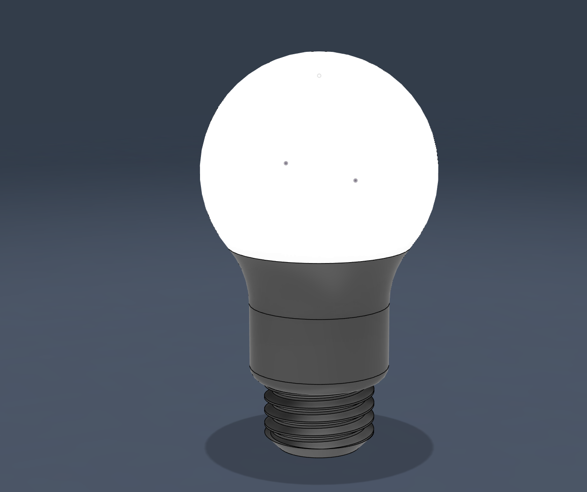

#📝 I learned...

**Cylinder and Sphere **
  - Preferably used when designing small projects.
  - If used in complexed designs, it might make parametric edits harder to perform.

🛠️ **What I designed**

A light bulb

  <figure>
    
    <figcaption style="display: block; text-align: center;">Final product of the light bulb.</figcaption>
  </figure>

